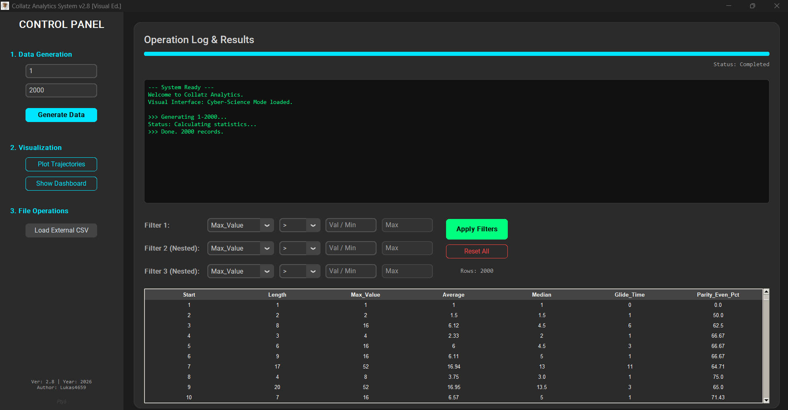
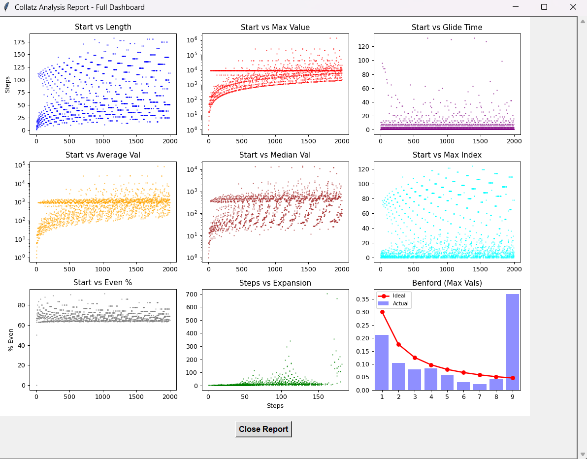

# Collatz Analytics System v2.1 📉


## 📌 Overview
**Collatz Analytics System** is a robust, multi-threaded desktop application designed to investigate the **Collatz Conjecture** (3n + 1 problem).

Unlike simple visualizers, this tool offers a complete data pipeline: from mass generation of sequences, through statistical analysis (Glide Time, Expansion Factor, Benford's Law), to interactive visualization. The project features a hybrid architecture with a shared backend (`collatz_tools`) powering both a CLI tool and a modern GUI.

## 🚀 Key Features

### 🖥️ Modern GUI (CustomTkinter)
- **Multi-threaded Processing**: Performs heavy calculations in the background without freezing the interface.
- **Interactive Data Table**: Sort and filter results (e.g., find all sequences where `Max_Value > 10,000` or `Glide_Time > 50`).
- **Real-time Logs**: Integrated console output within the application window.
- **Easter Egg**: Hidden feature ("Ptyś") for curious users.

### 📊 Advanced Statistics
The application calculates detailed metrics for every sequence:
- **Glide Time**: Steps taken to drop below the starting value.
- **Expansion Factor**: Ratio of `Max_Value` to `Start_Value`.
- **Benford's Law Analysis**: Checks the distribution of leading digits in sequence peaks (detects anomalies in specific ranges).
- **Parity Balance**: Percentage of even vs. odd numbers.

### 📈 Visualization Modes
1. **Trajectory Plot**: Log-scale line charts showing the chaotic path of sequences.
2. **Stats Dashboard**: A 3x3 grid of scatter plots revealing correlations (e.g., *Start Number* vs. *Glide Time*). Note: The dashboard updates dynamically based on the filtered table data!

### 📸 Screenshots




---

## 🛠️ Installation

1. **Clone the repository:**
   ```bash
   git clone https://github.com/Lukas4659/collatz-analytics.git
   cd collatz-analytics

2. **Install dependencies:**
   ```bash
   pip install -r requirements.txt

3. **Run the application:**
- GUI Version:
   ```bash
  python main_gui.py
- Terminal Version:
   ```bash
  python data_generation.py
  python statistics.py
  python vizualization.py

## 📂 Project Structure
- main_gui.py - Main entry point for the Desktop Application (GUI).
- collatz_tools.py - Core logic library (Math, File I/O, Plotting Engine).
- vizualization.py - CLI / Terminal interface for quick visualization.
- data_generation.py - Script for headless mass data generation.
- statistics.py - Script for calculating stats from raw CSV data.

## 🔍 How to Use
1. **Generate Data:** Enter a range (e.g., 1 to 1000) and click **Generate**
2. **Filter:** Use the bottom panel to filter interesting cases (e.g., "Show me sequences with Max Value > 5000").
3. **Visualize:** Click **Show Statistics** Dashboard to see correlations for your filtered dataset.

## 📜 License
This project is open-source and available for educational purposes.

Created by [Lukas4659] | 2026
